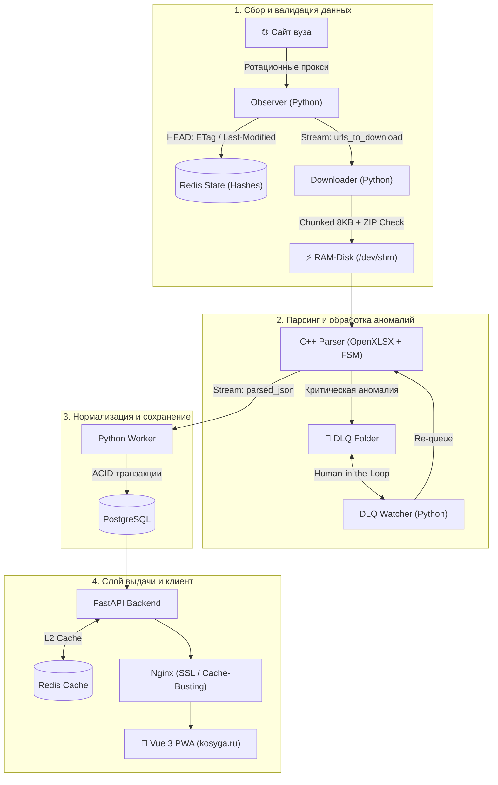

# Kosygin Schedule Pipeline & PWA

Высокопроизводительный отказоустойчивый ETL-пайплайн и PWA-приложение для автоматического сбора, нормализации и отображения студенческого расписания РГУ им. А.Н. Косыгина.

Система решает проблему ручной обработки нестабильных Excel-таблиц деканата, агрегируя данные через распределенные микросервисы и предоставляя студентам мгновенный мобильный доступ к актуальному расписанию.

---
## 🌐 Production & Live Demo

Проект полностью задеплоен, работает в продакшене и доступен для использования:

🔗 **[kosyga.ru](https://kosyga.ru)**

*Приложение оптимизировано под мобильные устройства как PWA (можно установить на домашний экран смартфона через браузер).*

## Архитектура системы

Пайплайн построен по принципам слабой связности. Межсервисное взаимодействие и передача очередей задач изолированы через **Redis Streams** и **Redis Hashes**.



---

## Ключевые инженерные решения и отказоустойчивость

### 1. Сбор данных и защита от сетевых аномалий (Observer & Downloader)

* **DOM Anomaly Detection (Circuit Breaker):** При каждом сканировании парсер агрегирует метрики структуры сайта. Если количество ключевых DOM-узлов (кафедры, институты) резко падает ниже заданного порога (`thresholds`), процесс парсинга прерывается для предотвращения отравления базы данных пустыми записями.
* **Идемпотентность и распознавание изменений:** Защита от избыточных скачиваний через каскад проверок в HTTP HEAD-запросах: `ETag` $\rightarrow$ `Last-Modified` $\rightarrow$ `Content-Length`.
* **RAM-Disk I/O (`/dev/shm`):** Скачивание файлов производится чанками по 8 КБ напрямую в виртуальный диск в оперативной памяти (`tmpfs` 128 МБ). Воркер поддерживает жесткое ограничение на 100 МБ для предотвращения Out-of-Memory (OOM).
* **Early ZIP Validation:** Целостность `.xlsx` структуры валидируется чтением заголовков ZIP-архива на этапе загрузки, что отсекает поврежденные файлы до их передачи в C++ движок.

### 2. Высокоскоростной парсер таблиц на C++ (OpenXLSX)

* **Плавающий поиск шапки по словарям синонимов:** Деканат периодически меняет порядок колонок и допускает сокращения («ауд.», «аудитория», «каб.»). Парсер анализирует матрицу ячеек по словарям синонимов и динамически вычисляет Y-координаты целевых полей, абстрагируясь от расположения колонок.
* **Автомат состояни:** Обработка строк таблицы изолирована в сканнер с конечным числом состояний:
* `Initialized` — инициализация контекста группы.
* `EducationalPlaces` — определение привязки корпусов/площадок к дням недели.
* `LessonRow` / `BlankLessonRow` — валидные пары и окна.
* `EmptyRow` / `ErrorRow` — детектирование конца таблицы (прерывание после 5 пустых строк).


* **Crash-Resilient SafeRedis:** Собственная C++ обертка над `redis-plus-plus` с обработкой сетевых исключений. При обрыве соединения или рестарте Redis бинарник переходит в режим ожидания с периодическим пингом каждые 2 секунды без аварийного завершения процесса (Zero-Crash Policy).
* **Деструктивный парсинг:** Успешно обработанные листы удаляются из книги прямо во время прохода. В случае ошибок в карантин (DLQ) отправляется только остаток проблемных данных.

### 3. Механизм Dead Letter Queue & Human-in-the-Loop

* **Карантинная изоляция:** Файлы с критическими логическими ошибками деканата маркируются метатегом `Modified_by = C++` и сбрасываются в локальную DLQ-директорию.
* **Автоматический возврат в пайплайн (DLQ Watcher):** Фоновый демон отслеживает изменения в метаданных файлов. Как только разработчик вручную исправляет опечатку и сохраняет файл (`Modified_by != C++`), Watcher детектирует изменение и возвращает файл в очередь `Redis Streams` для повторного прогона.

### 4. Транзакционный воркер и слой доставки данных (Python / FastAPI)

* **ACID Transaction Per Group:** Вся сетка расписания для конкретной группы пишется в PostgreSQL в рамках единой транзакции (SQLAlchemy 2.0 / `asyncpg`). Ошибки валидации Pydantic откатывают транзакцию целиком, исключая частичное обновление.
* **Многоуровневое кэширование:** Эндпоинты FastAPI закрыты кэшированием в Redis и корректными HTTP-заголовками кэширования (`Cache-Control`, `ETag`), минимизируя нагрузку на PostgreSQL.

### 5. Наблюдаемость и мониторинг (Observability)

* **Telegram Alerting с дедупликацией сообщений:** Сервис алертов слушает единый поток ошибок `notifier:queue`. Для предотвращения спама в Telegram API реализовано окно агрегации: повторяющиеся за 24 часа ошибки объединяются в одно сообщение через `editMessageText` с инкрементом счетчика. Пример сообщения:
> 🚨 **[CRITICAL] | Python worker**  
> **Событие:** Неизвестная ошибка  
>  
> **Контекст:**  
> ▪️ `10x` | `IntegrityError`
* **Мониторинг инфраструктуры:** Интеграция с Uptime Kuma (пассивные HTTP Push-мониторы) и Beszel (легковесный сбор метрик CPU/RAM/диска контейнеров).

---

## Стек технологий

| Область | Технологии | Назначение / Обоснование |
| --- | --- | --- |
| **Backend Core** | Python 3.11+, FastAPI, Uvicorn | Асинхронное REST API с быстрым временем ответа |
| **Data Layer** | PostgreSQL 15, SQLAlchemy 2.0, asyncpg | Реляционное хранилище с ACID-гарантиями для сущностей расписания |
| **Message Broker / Cache** | Redis 7+ (Streams, Hashes, Key-Value) | Шина событий для микросервисов и L2-кэш для API |
| **Heavy Processing** | C++17/20, OpenXLSX, nlohmann-json | Быстрый парсинг Excel без накладных расходов на GIL и память |
| **Scraping & Ingestion** | aiohttp, BeautifulSoup4 (lxml), pydantic | Асинхронный сбор данных с ротацией прокси и валидацией схем |
| **Frontend / Client** | Vue 3, TypeScript, Vite, TailwindCSS | Мобильное PWA-приложение с offline-first кэшированием |
| **DevOps & Infra** | Docker, Docker Compose, Nginx, Certbot | Multi-profile контейнеризация, SSL-терминация, log rotation |
| **Monitoring** | Uptime Kuma, Beszel, Telegram Bot API | Метрики контейнеров, статус сервисов и дедуплицированный алертинг |

---

## Локальный запуск и разработка

Проект полностью контейнеризирован и поддерживает запуск через профили Docker Compose без необходимости ручного создания `.env` (все параметры имеют безопасные fallback-значения).

### Требования

* Docker 24.0+
* Docker Compose V2

### 1. Запуск в режиме разработки с мок-данными (Mock Profile)

Запуск бэкенда, базы данных, Redis и скрипта, генерирующего тестовые Excel-файлы в RAM-диск:

```bash
docker compose --profile mock up --build

```

### 2. Запуск полного локального контура (Local Profile)

Запуск полного пайплайна (Observer, Downloader, C++ Parser, Worker, FastAPI, Local Frontend):

```bash
docker compose --profile local up --build

```

> 💡 **Примечание по загрузке образов:**  
> Если при загрузке базовых образов (PostgreSQL/Redis) возникают сетевые задержки или таймауты Docker Hub, рекомендуется настроить локальные зеркала в `/etc/docker/daemon.json` (или Docker Desktop -> Docker Engine):
>
> ```json
> {
>   "registry-mirrors": [
>     "https://mirror.gcr.io",
>     "https://dockerhub.timeweb.cloud"
>   ]
> }

> ```
### 3. Доступ к сервисам

* **Swagger API Docs:** [http://localhost:8000/docs](http://localhost:8000/docs)
* **Frontend Application:** [http://localhost:80](http://localhost:80)
* **PostgreSQL:** `localhost:5432` (по умолчанию: user=`admin`, pass=`super_password`, db=`database`)
* **Redis:** `localhost:6379`


