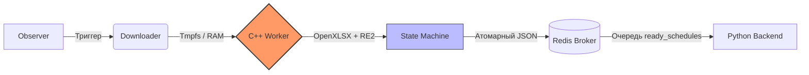

# 🎓 Парсер университетского расписания (Event-Driven C++ Worker)

[](https://isocpp.org/)
[](https://cmake.org/)
[](https://redis.io/)

Высокопроизводительный C++ микросервис, реализующий событийно-ориентированную (event-driven) архитектуру. Предназначен для извлечения, очистки и трансформации грязных данных университетского расписания из сырых `.xlsx` файлов в атомарные JSON-структуры.

Данный проект выступает в роли **Data Extraction & Transform** фазы (ядро Worker) в рамках крупного пайплайна. Для полной отвязки тяжелой логики парсинга от основного бэкенда используется брокер сообщений Redis.

## 🏗️ Архитектура (Tracer Bullet MVP)

Пайплайн спроектирован с упором на независимость компонентов.



### Ключевые особенности C++ Worker:
* **Синтаксический анализ через конечные автоматы (State Machine):** Итерация по строкам Excel происходит через строгую смену состояний (`EmptyRow`, `LessonRow`, `EducationalPlaces`), что позволяет корректно обрабатывать объединенные ячейки и неструктурированный мусор.
* **Высокоскоростные регулярные выражения:** Интеграция движка Google `RE2` для быстрого и безопасного извлечения метаданных (даты, время, формы обучения) без риска деградации производительности из-за возвратов (backtracking).
* **Binary-Safe брокер сообщений:** Прямая сериализация расписания в JSON (`nlohmann/json`) и отправка сырых байтов в Redis через `redis-plus-plus`.
* **Безопасная обработка кириллицы:** Написаны собственные низкоуровневые обработчики UTF-8 для приведения русского текста к нижнему регистру без использования тяжелых локалей (locales) ОС.

## 🛠️ Стек технологий

* **Язык:** C++20
* **Система сборки:** CMake
* **Библиотеки:**
  * [OpenXLSX](https://github.com/troldal/OpenXLSX) — чтение файлов Excel.
  * [nlohmann/json](https://github.com/nlohmann/json) — сериализация и работа с JSON.
  * [RE2](https://github.com/google/re2) — быстрые регулярные выражения.
  * [redis-plus-plus](https://github.com/sewenew/redis-plus-plus) (построена поверх `hiredis`) — клиент для Redis.

## 🚀 Сборка и запуск

Склонируйте репозиторий и соберите проект с помощью CMake (out-of-source сборка):

```bash
# 1. Клонирование репозитория
git clone https://github.com/Integoneo/schedule-excel-parser-CPlusPlus.git
cd schedule-excel-parser-CPlusPlus

# 2. Генерация файлов сборки
mkdir build && cd build
cmake ..

# 3. Компиляция воркера
make run
```

**Запуск:**
Убедитесь, что у вас запущен локальный сервер Redis на порту `127.0.0.1:6379`.
```bash
./worker
```

## 🗺️ Roadmap и планы развития
- [x] **MVP:** Сквозной пайплайн от чтения Excel до отправки JSON в Redis.
- [ ] **Многопоточность:** Внедрение пула потоков для параллельного парсинга нескольких файлов Excel.
- [ ] **Полиморфные интерфейсы:** Абстрагирование логики парсинга для легкого добавления новых форматов расписания (например, расписания экзаменов).
- [ ] **Обработка ошибок:** Внедрение продвинутого логирования (отвалы Redis, битые файлы Excel).

---
*Разработано Павлом*
```
